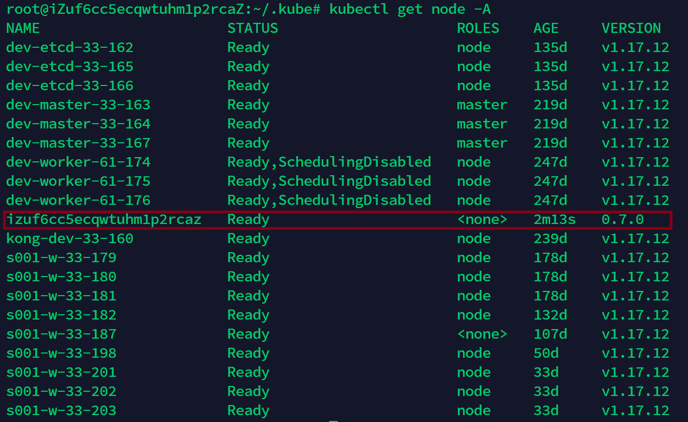
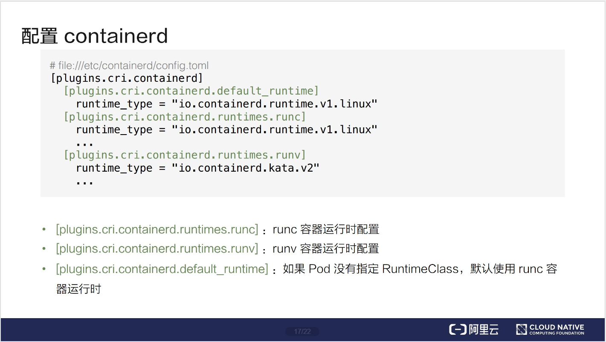

Webassembly（WASM）是 Next-Generation 的软件分发方式，具有跨语言、跨平台、自带运行时的无敌属性[^1]。知晓了它的美妙之处，我们自然会想拥有次世代的体验，本文描述尝试将轻量级 WASM 用类 OCI 打包方式调度到 K8s 集群中运行的过程，以及其中的艰辛之处。

WASM 在当前阶段还很尴尬，WASI（WebAssembly System Interface）还处于[早期阶段](https://github.com/WebAssembly/WASI/milestone/1)，WASM 运行时项目 [Wasmer](https://github.com/wasmerio/wasmer) 与 [wasmtime](https://github.com/bytecodealliance/wasmtime) 对于多语言的支持还不足，云厂商例如 Cloudflare 与 AWS Lambda@Edge 都不是原生支持 WASM，WASM 的执行性能也可能比不上 Google 的 v8 JavaScript 引擎。

当我们也看到了一些希望：Go 官方也许会[支持 WASI](https://github.com/golang/go/issues/31105)、APISIX 准备[使用 Wamser 作为 WASM 运行时](https://github.com/apache/apisix/issues/157)。

我当前在进行的另一个项目也通过在浏览器中加载 WASM 实现 X.509 证书解析、签名与 ACME 申请证书，该项目还会使用 Serverless 技术进行流量代理，不过这个坑何时能填完就没有人知道了 💀。

## 1. Krustlet 调度 WASM

> Krustlet 介绍：[使用 Rust 开发的 kubelet，用于运行 WASM 工作负载](https://www.infoq.cn/article/oumc77mjsl67m39lqgtg)

概述：Krustlet 的工作方式类似于 Kubelet，是在 K8s 集群工作节点上运行的后台程序，负责上报节点状态以及运行工作负载（WASM）。

目前不支持 CNI 网络。

### 1.1. 部署安装

#### 1.1.1. 测试环境

- 阿里云测试集群 - `192.168.33.161` 机器（2c 8g）

#### 1.1.2. 安装 Krustlet

```bash
#!/bin/bash

wget https://krustlet.blob.core.windows.net/releases/krustlet-v0.7.0-linux-amd64.tar.gz -O /tmp/krustlet.tar.gz
tar zxvf /tmp/krustlet.tar.gz && mv krustlet-wasi /usr/local/bin/
```

#### 1.1.3. 节点初始化

> 根据官方文档进行节点初始化: [quickstart](https://docs.krustlet.dev/intro/quickstart/)。

步骤：

1. 节点上安装 Kubectl 并配置有在 `kube-system` 下创建 CSR 资源的凭证
2. 执行初始化脚本

    ```bash
    bash <(curl https://raw.githubusercontent.com/deislabs/krustlet/master/docs/howto/assets/bootstrap.sh)
    ```

3. 创建 Systemd 文件 `/etc/systemd/system/krustlet.service`

    ```bash
    [Unit]
    Description=Krustlet, a kubelet implementation for running WASM

    [Service]
    Restart=on-failure
    RestartSec=5s
    Environment=KUBECONFIG=/root/.kube/config
    ExecStart=/usr/local/bin/krustlet-wasi
    User=root
    Group=root

    [Install]
    WantedBy=multi-user.target
    ```

    ```bash
    systemctl daemon-reload
    systemctl enable krustlet.service
    systemctl start krustlet.service
    ```

4. 审核 CSR 申请

    ```bash
    kubectl certificate approve ${HOSTNAME}-tls
    ```

#### 1.1.4. 节点状态




- Krustlet 节点详情 `kubectl describe node ${HOSTNAME}`

    ```bash
    Name:               izuf6cc5ecqwtuhm1p2rcaz
    Roles:              <none>
    Labels:             beta.kubernetes.io/arch=wasm32-wasi
                        beta.kubernetes.io/os=wasm32-wasi
                        kubernetes.io/arch=wasm32-wasi
                        kubernetes.io/hostname=iZuf6cc5ecqwtuhm1p2rcaZ
                        kubernetes.io/os=wasm32-wasi
                        type=krustlet
    Annotations:        node.alpha.kubernetes.io/ttl: 0
                        volumes.kubernetes.io/controller-managed-attach-detach: true
    CreationTimestamp:  Thu, 08 Jul 2021 14:45:26 +0800
    Taints:             kubernetes.io/arch=wasm32-wasi:NoExecute
                        kubernetes.io/arch=wasm32-wasi:NoSchedule
    Unschedulable:      false
    Lease:
      HolderIdentity:  izuf6cc5ecqwtuhm1p2rcaz
      AcquireTime:     Thu, 08 Jul 2021 14:49:37 +0800
      RenewTime:       Thu, 08 Jul 2021 14:49:37 +0800
    Conditions:
      Type        Status  LastHeartbeatTime                 LastTransitionTime                Reason                     Message
      ----        ------  -----------------                 ------------------                ------                     -------
      Ready       True    Thu, 08 Jul 2021 14:49:37 +0800   Thu, 08 Jul 2021 14:45:26 +0800   KubeletReady               kubelet is posting ready status
      OutOfDisk   False   Thu, 08 Jul 2021 14:45:26 +0800   Thu, 08 Jul 2021 14:45:26 +0800   KubeletHasSufficientDisk   kubelet has sufficient disk space available
    Addresses:
      InternalIP:  192.168.33.161
      Hostname:    iZuf6cc5ecqwtuhm1p2rcaZ
    Capacity:
      cpu:                4
      ephemeral-storage:  61255492Ki
      hugepages-1Gi:      0
      hugepages-2Mi:      0
      memory:             4032800Ki
      pods:               110
    Allocatable:
      cpu:                4
      ephemeral-storage:  61255492Ki
      hugepages-1Gi:      0
      hugepages-2Mi:      0
      memory:             4032800Ki
      pods:               110
    System Info:
      Machine ID:
      System UUID:
      Boot ID:
      Kernel Version:
      OS Image:
      Operating System:           linux
      Architecture:               wasm-wasi
      Container Runtime Version:  mvp
      Kubelet Version:            0.7.0
      Kube-Proxy Version:         v1.17.0
    PodCIDR:                      10.244.0.0/24
    PodCIDRs:                     10.244.0.0/24
    Non-terminated Pods:          (3 in total)
      Namespace                   Name                   CPU Requests  CPU Limits  Memory Requests  Memory Limits  Age
      ---------                   ----                   ------------  ----------  ---------------  -------------  ---
      kruise-system               kruise-daemon-v9nfh    0 (0%)        50m (1%)    0 (0%)           64Mi (1%)      4m17s
      kube-system                 calico-node-m4d67      150m (3%)     300m (7%)   64M (1%)         500M (12%)     4m17s
      kube-system                 nodelocaldns-k5kd2     100m (2%)     0 (0%)      70Mi (1%)        170Mi (4%)     4m17s
    Allocated resources:
      (Total limits may be over 100 percent, i.e., overcommitted.)
      Resource           Requests        Limits
      --------           --------        ------
      cpu                250m (6%)       350m (8%)
      memory             137400320 (3%)  745366784 (18%)
      ephemeral-storage  0 (0%)          0 (0%)
      hugepages-1Gi      0 (0%)          0 (0%)
      hugepages-2Mi      0 (0%)          0 (0%)
    Events:              <none>
    ```

节点带有两个污点：

```bash
Taints:             kubernetes.io/arch=wasm32-wasi:NoExecute
                    kubernetes.io/arch=wasm32-wasi:NoSchedule
```

### 1.2. WASM OCI

Krustlet 使用 [wasm-to-oci](https://github.com/engineerd/wasm-to-oci) 打包 WASM 编译后的二进制文件到镜像仓库。

#### 1.2.1. 推送镜像

安装 wasm-to-oci CLI

```bash
wget https://github.com/engineerd/wasm-to-oci/releases/download/v0.1.2/linux-amd64-wasm-to-oci -O /usr/local/bin/wasm-to-oci \
&& chmod +x /usr/local/bin/wasm-to-oci
```

- `wasm-to-oci` Usage

    ```bash
    Usage:
      wasm-to-oci [command]

    Available Commands:
      help        Help about any command
      pull        Pulls a WASM module from an OCI registry
      push        Pushes a WASM module from an OCI registry

    Flags:
      -d, --dir string         Directory where the trust data is persisted to (default "/root/.wasm-to-oci")
      -h, --help               help for wasm-to-oci
          --insecure           allow connections to SSL registry without certs
          --log string         Set the logging level ("debug"|"info"|"warn"|"error"|"fatal") (default "info")
          --server string      The trust server used (default "https://notary.docker.io")
      -t, --timeout string     Timeout for the trust server (default "5s")
          --tlscacert string   Trust certs signed only by this CA
          --use-http           use plain http and not https
    ```

打包示例 WASM（二进制编译后的文件）

```bash
wget https://github.com/engineerd/wasm-to-oci/raw/master/testdata/hello.wasm
wasm-to-oci push hello.wasm harbor.domain.dev/bifrost/hello-wasm:v1
```

> Docker 需要有 Registry 的凭证 `~/.docker/config.json`

Push 输出：

```bash
INFO[0001] Pushed: harbor.domain.dev/bifrost/hello-wasm:v1
INFO[0001] Size: 1624962
INFO[0001] Digest: sha256:a01f32cc647abe49bb34727cc2c520e6e304e3049d669f53e2d30d49ee2ed9c7
```

wasm-oci 使用了自定义的 OCI Layer，属于非标准类型。

> [Securely distributing and signing WebAssembly modules using OCI and TUF](https://radu-matei.com/blog/wasm-oci-tuf/)

```json
{
  "schemaVersion": 2,
  "config": {
    "mediaType": "application/vnd.wasm.config.v1+json",
    "digest": "sha256:44136fa355b3678a1146ad16f7e8649e94fb4fc21fe77e8310c060f61caaff8a",
    "size": 2
  },
  "layers": [
    {
      "mediaType": "application/vnd.wasm.content.layer.v1+wasm",
      "digest": "sha256:4c7915b4c1f9b0c13f962998e4199ceb00db39a4a7fa4554f40ae0bed83d9510",
      "size": 1624962
    }
  ]
}
```

#### 1.2.2. 拉取镜像

由于是非标准格式的 OCI 镜像，直接使用 Docker CLI 拉取会出错：

```bash
v1: Pulling from bifrost/hello-wasm
4c7915b4c1f9: Pulling fs layer
invalid rootfs in image configuration
```

#### 1.2.3. WASM module 与容器区别

[Krustlet-tutorial pod get stuck in init:regitered status · Issue #624 · deislabs/krustlet](https://github.com/deislabs/krustlet/issues/624#issuecomment-855607557)

- WASM OCI 不是 Docker 容器
- WASM OCI 不能使用 Docker pull

### 1.3. WASM Pod 调度

WASM 调度的最小单元是 Pod，Pod 定义中必须包含 WASM 节点的 tolerations。

#### 1.3.1. Pod 调度

示例 Pod：

```yaml
apiVersion: v1
kind: Pod
metadata:
  name: wasm-hello
spec:
  containers:
    - name: wasm-hello
      image: harbor.domain.dev/bifrost/hello-wasm:v1
  tolerations:
    - key: "kubernetes.io/arch"
      operator: "Equal"
      value: "wasm32-wasi"
      effect: "NoExecute"
    - key: "kubernetes.io/arch"
      operator: "Equal"
      value: "wasm32-wasi"
      effect: "NoSchedule"
```

```bash
> k apply -f wasm-hello.yaml
pod/wasm-hello created
```

- 小插曲

    试验过程中发现使用 wasm-to-oci 推送镜像到自建的 Harbor 镜像仓库后，拉取镜像时会报错。

    [Krustlet-tutorial pod get stuck in init:regitered status · Issue #624 · deislabs/krustlet](https://github.com/deislabs/krustlet/issues/624)

    关联到一个 Issue，部分 Registry 会无法拉取镜像，报错：

    ```bash
    krustlet-wasi[20706]: [2021-07-08T08:31:46Z DEBUG hyper::proto::h1::conn] incoming body is content-length (950 bytes)
    krustlet-wasi[20706]: [2021-07-08T08:31:46Z DEBUG hyper::proto::h1::conn] incoming body completed
    krustlet-wasi[20706]: [2021-07-08T08:31:46Z DEBUG hyper::client::pool] pooling idle connection for ("https", harbor....)
    krustlet-wasi[20706]: [2021-07-08T08:31:46Z DEBUG reqwest::async_impl::client] response '200 OK' for https://harbor..../service/token?scope=repository%3Abifrost%2Fhello-wasm%3Apull&service=harbor-registry
    krustlet-wasi[20706]: [2021-07-08T08:31:46Z DEBUG oci_distribution::client] Received response from auth request: {"token":"...","access_token":"","expires_in":1800,"issued_at":"2021-07-08T08:31:46Z"}
    krustlet-wasi[20706]: [2021-07-08T08:31:46Z ERROR kubelet::state::common::image_pull] Failed to decode registry token from auth request
    krustlet-wasi[20706]:
    krustlet-wasi[20706]:     Caused by:
    krustlet-wasi[20706]:         duplicate field `token` at line 1 column 1129
    krustlet-wasi[20706]: [2021-07-08T08:31:46Z DEBUG krator::state] State::status
    krustlet-wasi[20706]: [2021-07-08T08:31:46Z DEBUG krator::state] Applying status patch to object. name=wasm-hello patch={"metadata":{"resourceVersion":""},"status":{"phase":"Pending","message":"ImagePullBackoff","reason":"ImagePullBackoff"}}
    ```

    将镜像替换为 [`webassembly.azurecr.io/hello-world-wasi-rust:v0.1.0`](http://webassembly.azurecr.io/hello-world-wasi-rust:v0.1.0) 可正常运行。

#### 1.3.2. Pod 运行时

查看 Pod 运行状态：

```bash
> k get pod -n ns-msp | grep wasm
wasm-hello        0/1     ExitCode:0         0          13m
```

Pod 被调度后立刻被执行，返回 ExitCode 0。

```bash
> k logs -n ns-msp -f wasm-hello
hello from stdout!
hello from stderr!
Args are: []
```

kubectl 查看与运行日志。

- Pod YAML

    ```yaml
    apiVersion: v1
    kind: Pod
    metadata:
      creationTimestamp: "2021-07-08T08:37:39Z"
      name: wasm-hello
      namespace: ns-msp
      resourceVersion: "543645433"
      selfLink: /api/v1/namespaces/ns-msp/pods/wasm-hello
      uid: 09f74071-fd90-45be-be7d-466ef211043a
    spec:
      containers:
      - image: webassembly.azurecr.io/hello-world-wasi-rust:v0.1.0
        imagePullPolicy: IfNotPresent
        name: wasm-hello
        resources: {}
        terminationMessagePath: /dev/termination-log
        terminationMessagePolicy: File
        volumeMounts:
        - mountPath: /var/run/secrets/kubernetes.io/serviceaccount
          name: default-token-h8q2z
          readOnly: true
      dnsPolicy: ClusterFirst
      enableServiceLinks: true
      nodeName: izuf6cc5ecqwtuhm1p2rcaz
      priority: 0
      restartPolicy: Always
      schedulerName: default-scheduler
      securityContext: {}
      serviceAccount: default
      serviceAccountName: default
      terminationGracePeriodSeconds: 30
      tolerations:
      - effect: NoExecute
        key: kubernetes.io/arch
        operator: Equal
        value: wasm32-wasi
      - effect: NoSchedule
        key: kubernetes.io/arch
        operator: Equal
        value: wasm32-wasi
      - effect: NoExecute
        key: node.kubernetes.io/not-ready
        operator: Exists
        tolerationSeconds: 300
      - effect: NoExecute
        key: node.kubernetes.io/unreachable
        operator: Exists
        tolerationSeconds: 300
      volumes:
      - name: default-token-h8q2z
        secret:
          defaultMode: 420
          secretName: default-token-h8q2z
    status:
      conditions:
      - lastProbeTime: null
        lastTransitionTime: "2021-07-08T08:37:39Z"
        status: "True"
        type: PodScheduled
      containerStatuses:
      - image: ""
        imageID: ""
        lastState: {}
        name: wasm-hello
        ready: false
        restartCount: 0
        started: true
        state:
          terminated:
            exitCode: 0
            finishedAt: "2021-07-08T08:37:52Z"
            message: Module run completed
            startedAt: null
      message: Completed
      phase: Succeeded
      qosClass: BestEffort
      reason: Completed
    ```

## 2. Containerd 插件调度 WASM

> containerd-wasm 可以让 containerd 支持 WASM container，并且可以利用 Kubernetes 集群管理和调度 WASM container。

> 注：这个项目更多是概念验证，进程管理、资源限制，性能优化等的细节并没未完整实现。


“container-shim-wasm-v1” 作为 Containerd 的插件，利用 wasmer 作为 WASM 应用运行时环境，同时将其注册为 K8s 的一个 RuntimeClass ，利用 K8s 调度 WASM。

### 2.1. 部署安装

> 使用项目：[https://github.com/dippynark/containerd-shim-wasm](https://github.com/dippynark/containerd-shim-wasm)

验证需要一个使用 Containerd 的 K8s 集群环境，使用 Kind 部署集群。

```yaml
kind: Cluster
apiVersion: kind.x-k8s.io/v1alpha4
nodes:
- role: control-plane
  extraMounts:
  - hostPath: config/containerd.toml
    containerPath: /etc/containerd/config.toml
  - hostPath: bin/containerd-shim-wasm-v1
    containerPath: /usr/local/bin/containerd-shim-wasm-v1
  - hostPath: bin/wasmer
    containerPath: /usr/local/bin/wasmer
```

Containerd 的配置中配置 wasm Runtime：

```yaml
# Custom configuration
# https://github.com/containerd/cri/blob/master/docs/config.md
[plugins."io.containerd.grpc.v1.cri".containerd.runtimes.wasm]
  runtime_type = "io.containerd.wasm.v1"
```

> 参考文章：[理解 RuntimeClass 与使用多容器运行时](https://www.kubernetes.org.cn/7185.html)



Containerd 的 Runtime 会对应到 K8s 的 RuntimeClass。

```yaml
apiVersion: node.k8s.io/v1beta1
kind: RuntimeClass
metadata:
  name: wasm
handler: wasm
```

注册 K8s RuntimeClass 资源。

### 2.2. WASM Runtime 调度

#### 2.2.1. 编译 WASM Module

使用 target 为 `wasi/wasm` 进行编译，最终会使用 `wasm32-wasi-clang` 进行编译。

```docker
FROM --platform=$BUILDPLATFORM tonistiigi/xx:llvm AS builder
ARG TARGETPLATFORM
WORKDIR /src
COPY hello-wasm/main.c .
RUN clang -static -o /hello-wasm main.c

FROM scratch
COPY --from=builder /hello-wasm .
CMD ["/hello-wasm"]
```

虽然 Dockerfile 里写了 `CMD` ，但是如果直接在操作系统上执行命令，会报错：

```bash
> ./bin/hello-wasm
zsh: exec format error: ./bin/hello-wasm
```

推测 [`github.com/dmcgowan/containerd-wasm`](https://github.com/dmcgowan/containerd-wasm) 库实际上会解析 Container 文件系统，提取出要执行的 WASM module，最后调用运行时（wasmtime/wasmer）运行 WASM。

我们实际使用任意的 WASM module 打包进 Docker 容器中：

```docker
FROM scratch
COPY ./hello.wasm .
CMD ["/hello.wasm"]
```

#### 2.2.2. 调度 Pod

```yaml
apiVersion: apps/v1
kind: Deployment
metadata:
  name: hello-wasm
spec:
  selector:
    matchLabels:
      app: hello-wasm
  template:
    metadata:
      labels:
        app: hello-wasm
    spec:
      runtimeClassName: wasm
      containers:
      - name: hello-wasm
        ## WASM 编译打包的 Docker 镜像
        image: harbor.domain.dev/bifrost/hello-wasm2:v1
        imagePullPolicy: Always
```

Pod 运行状态：

```yaml
default  hello-wasm-86db957848-cgvdj     0/1     Completed     0      7s
```

Pod 输出日志：

```bash
> kubectl logs hello-wasm-86db957848-cgvdj
Hello from WebAssembly!
```

### 2.3. 对比 Krustlet

> One difficulty with this shim implementation is that the shim API assumes a container runtime (as that's what it was designed for), but this doens't align as well with running WebAssmebly modules (for example currently you can't exec into a WebAssmebly module as you would a container). The Krustlet project implements a Kubelet replacement that treats wasi/wasm modules as first class citizens.

作为 Containerd 插件的 WASM Runtime 实现起来较为简单，同时代码中有大量的 TODO。

但是参照其实现的模式，公司内部也可自行实行一套 WASM 模块分发机制，运行时只需加载对应模块，调用（wasmtime/wasmer）运行即可。


[^1]: Webassembly 在各类文章中被捧上天，但是截至 2021 年它的使用场景还十分局限。
